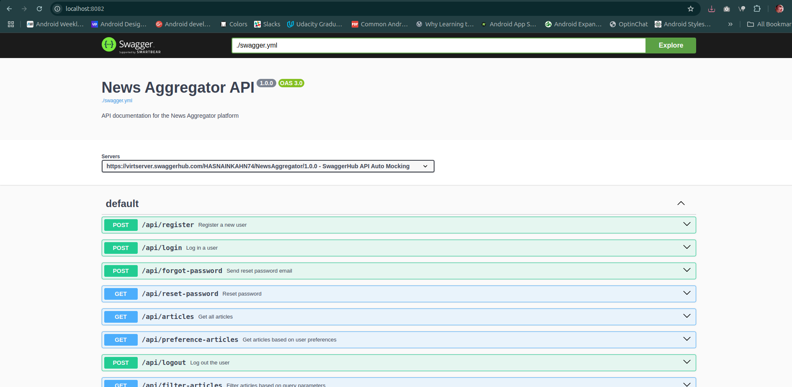

# NewsAggregator API Documentation

## Overview

The **NewsAggregator** project is a system designed to fetch, store, and manage news articles from three major APIs: **New York Times**, **BBC News**, and **NewsAPI**. Articles are collected daily using a scheduled task, and users can manually fetch them as needed. The system provides various API endpoints to handle user registration, login, preferences, and article management.

---

## Installation Guide

### Prerequisites

Before running the **NewsAggregator API** project, ensure you have **Docker** and **Docker Compose** installed on your machine.

---

### 1. **Installing Docker and Docker Compose**

#### 1.1 **Mac**

1. Visit the [Docker Desktop for Mac](https://www.docker.com/products/docker-desktop) page.
2. Download the **Docker Desktop for Mac** installer.
3. Open the downloaded `.dmg` file and drag the Docker icon into the **Applications** folder.
4. Launch **Docker Desktop** from your **Applications** folder.
5. Follow the on-screen instructions to complete the installation.
6. Once Docker is running, verify the installation by running the following commands in your terminal:

   ```bash
   docker --version
   docker-compose --version

#### 1.2 **Windows**
1. Visit the [Docker Desktop for Windows](https://www.docker.com/products/docker-desktop/) page.
2. Download the **Docker Desktop** for Windows installer.
3. Run the installer and follow the on-screen instructions.
4. Once the installation is complete, launch Docker Desktop.
5. Docker Desktop may ask you to enable **WSL 2** if not already installed.
6. After installation, verify the Docker installation by running the following commands in your terminal:

   ```bash
   docker --version
   docker-compose --version

#### 1.3 **Linux (Ubuntu)**
1. Open a terminal window and run the following command to install Docker:

   ```bash
   sudo apt-get update
   sudo apt-get install apt-transport-https ca-certificates curl software-properties-common
   ```
2. Add Docker’s official GPG key:

   ```bash
   curl -fsSL https://download.docker.com/linux/ubuntu/gpg | sudo apt-key add -
   ```
3. Add the Docker repository: 

   ```bash
   sudo add-apt-repository "deb [arch=amd64] https://download.docker.com/linux/ubuntu $(lsb_release -cs) stable"
   ```
4. Install Docker:

   ```bash
   sudo apt-get update
   sudo apt-get install docker-ce
   ```
5. Install Docker Compose:

   ```bash
   sudo curl -L "https://github.com/docker/compose/releases/download/1.29.2/docker-compose-$(uname -s)-$(uname -m)" -o /usr/local/bin/docker-compose
   sudo chmod +x /usr/local/bin/docker-compose
   ```
6. After installation, verify the Docker installation by running the following commands in your terminal:

   ```bash
   docker --version
   docker-compose --version
   
7. Verify Docker and Docker Compose installation:

   ```bash
   docker --version
   docker-compose --version
   
---

### 2. **Cloning the Repository**
1. Open a terminal window.
2. Change the current working directory to the location where you want the cloned directory.
3. Run the following command to clone the repository:

   ```bash
   git clone https://github.com/your-username/news-generation-api.git
   cd news-generation-api
   ```

---
## Composer
First install the composer dependencies:
`composer install`

---

## Docker Setup
1. build the containers:
`docker-compose build --no-cache`

2. Run the containers:
`docker-compose up -d`

3. Access URL:
`http://127.0.0.1:8081`

4. The following ports are exposed:
- **App:** 8081 (http://127.0.0.1:8081)
- **MySQL:** 3307 (alternatively try 3306 if 3307 is not working for you)
- **PhpMyAdmin:** 8080 (http://127.0.0.1:8080)
- **Swagger:** 8082 (http://127.0.0.1:8082)

---
## Swagger API Documentation
I have already added the required code to the docker-compose.yml file to run the Swagger API documentation. You can access it after running the containers by visiting the following URL:

`http://127.0.0.1:8082`

I added the /swagger/swagger.yml file to make it work for the above URL.

Alternatively you can open the file in Phpstorm and click on the Swagger icon to view the API documentation.
Or you can open the file in a browser and view the API documentation.
Just in case for some reason it is not working on your end.

But its working fine on my end and I have tested it.


---

## Database Setup
Run the migrations:
`php artisan migrate`

---
## Unit tests
To run the unit tests, run the following command:

`docker-compose exec app vendor/bin/phpunit /var/www/html/tests`

OR

`docker-compose exec app php artisan test`

---

## Features

1. **Daily News Fetching**  
   Articles are automatically fetched from external APIs daily using a scheduler.

    - To run the scheduler manually:

      `php artisan fetch:articles`

2. **User Management**  
   Users can register, log in, reset their passwords, and log out using the provided API endpoints.

3. **Article Preferences and Filtering**  
   Users can view articles tailored to their preferences or filter articles by specific keywords.

4. **Secure Authentication**  
   Access to certain endpoints is secured with a Bearer Token.

---

## API Endpoints

### 1. Register a New User
**Endpoint:**  
`POST http://127.0.0.1:8081/api/register`

**Headers:**
- Content-Type: `application/json`
- Accept: `application/json`

**Body (form-data):**
- `email`: User's email address.
- `name`: User's name.
- `password`: User's password.
- `password_confirmation`: Confirm the password.

---

### 2. User Login
**Endpoint:**  
`POST http://127.0.0.1:8081/api/login`

**Headers:**
- Content-Type: `application/json`
- Accept: `application/json`

**Query Parameters:**
- `email`: Registered email address.
- `password`: Password.

---

### 3. Forgot Password
**Endpoint:**  
`POST http://127.0.0.1:8081/api/forgot-password`

**Body (form-data):**
- `email`: Registered email to send the reset link.

---

### 4. Password Reset
**Endpoint:**  
`POST http://127.0.0.1:8081/api/login`

**Body (form-data):**
- `email`: User's email address.
- `password`: New password.

---

### 5. View Articles
**Endpoint:**  
`GET http://127.0.0.1:8081/api/articles`

**Description:**  
Fetch all articles from the database.

---

### 6. View User Preference Articles
**Endpoint:**  
`GET http://127.0.0.1:8081/api/preference-articles`

**Headers:**
- Authorization: Bearer Token

**Description:**  
Fetch articles based on the user's saved preferences.

---

### 7. Filter Articles
**Endpoint:**  
`GET http://127.0.0.1:8081/api/filter-articles?keyword=sport`

**Headers:**
- Content-Type: `application/json`
- Accept: `application/json`
- Authorization: Bearer Token

**Query Parameters:**
- `keyword`: Filter articles using a specific keyword.

---

### 8. User Preferences
**Endpoint:**  
`GET http://127.0.0.1:8081/api/user-preference`

**Description:**  
Fetch the user's preference settings.

---

### 9. Logout
**Endpoint:**  
`GET http://127.0.0.1:8081/api/logout`

**Description:**  
Log out the authenticated user.
---
## Scheduler Details

- **Daily Article Fetching:**  
  A Laravel scheduler fetches articles daily. If needed, run the following command manually to fetch articles:

  `php artisan fetch:articles`
